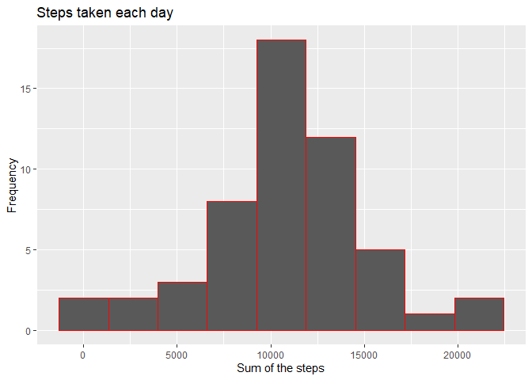
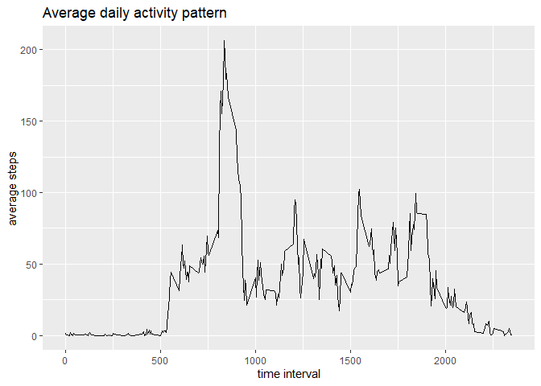
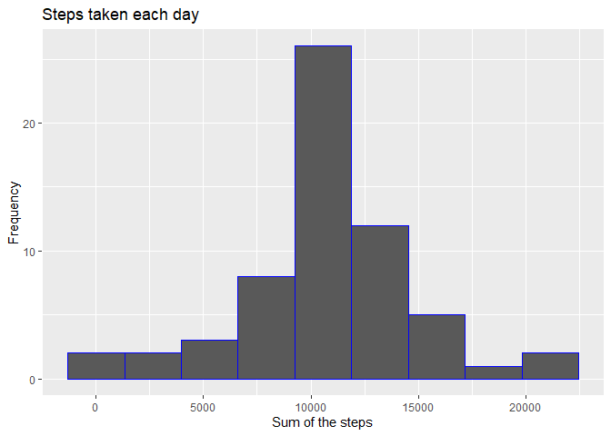
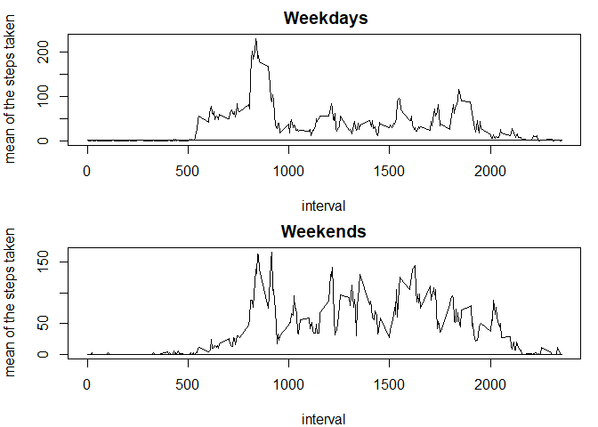

## Loading and preprocessing the data
Checking for file in working directory, otherwise unzip the .zip archive. Read 
file as .csv.


```r
filename<-"activity.csv"
if(!file.exists(filename)) 
    unzip("activity.zip")
activity<-read.csv(filename)
```

## What is mean total number of steps taken per day?

### Сalculation the total number of steps
Firstly, just simple calculation of all steps taken per day:


```r
sapply(split(activity$steps, activity$date), sum)
```

```
## 2012-10-01 2012-10-02 2012-10-03 2012-10-04 2012-10-05 2012-10-06 2012-10-07 
##         NA        126      11352      12116      13294      15420      11015 
## 2012-10-08 2012-10-09 2012-10-10 2012-10-11 2012-10-12 2012-10-13 2012-10-14 
##         NA      12811       9900      10304      17382      12426      15098 
## 2012-10-15 2012-10-16 2012-10-17 2012-10-18 2012-10-19 2012-10-20 2012-10-21 
##      10139      15084      13452      10056      11829      10395       8821 
## 2012-10-22 2012-10-23 2012-10-24 2012-10-25 2012-10-26 2012-10-27 2012-10-28 
##      13460       8918       8355       2492       6778      10119      11458 
## 2012-10-29 2012-10-30 2012-10-31 2012-11-01 2012-11-02 2012-11-03 2012-11-04 
##       5018       9819      15414         NA      10600      10571         NA 
## 2012-11-05 2012-11-06 2012-11-07 2012-11-08 2012-11-09 2012-11-10 2012-11-11 
##      10439       8334      12883       3219         NA         NA      12608 
## 2012-11-12 2012-11-13 2012-11-14 2012-11-15 2012-11-16 2012-11-17 2012-11-18 
##      10765       7336         NA         41       5441      14339      15110 
## 2012-11-19 2012-11-20 2012-11-21 2012-11-22 2012-11-23 2012-11-24 2012-11-25 
##       8841       4472      12787      20427      21194      14478      11834 
## 2012-11-26 2012-11-27 2012-11-28 2012-11-29 2012-11-30 
##      11162      13646      10183       7047         NA
```

### Making a histogram
Then let's make a histogram of the total number of steps taken each day


```r
library(ggplot2)

with(activity, qplot(sapply(split(steps,date), sum),bins = 9, 
                     main = "Steps taken each day",
                     xlab = "Sum of the steps",
                     ylab = "Frequency", colour = I("red")))
```

<!-- -->

### Calculate and report the mean and median of the total number of steps taken per day

Mean of the total number of steps per day:


```r
mean(sapply(split(activity$steps, activity$date), sum), na.rm = TRUE)
```

```
## [1] 10766.19
```

Median of the total number of steps per day:


```r
median(sapply(split(activity$steps, activity$date), sum),na.rm = TRUE)
```

```
## [1] 10765
```

## What is the average daily activity pattern?
Time series plot of the 5-minute interval (x-axis) and the average number of steps taken, averaged across all days (y-axis)

```r
interval.new<-as.data.frame(unique(activity$interval)) 
interval.new$mean<-sapply(split(activity$steps, activity$interval),
          mean, na.rm = TRUE)
colnames(interval.new)<-c("interval", "meanx")
ggplot(interval.new, aes(x=interval, y=meanx))+geom_line()+
    ggtitle("Average daily activity pattern")+
     ylab("average steps")+xlab("time interval")
```

<!-- -->

#### Which 5-minute interval, on average across all the days in the dataset, contains the maximum number of steps?


```r
subset(interval.new, interval.new$meanx==max(interval.new$meanx))
```

```
##     interval    meanx
## 104      835 206.1698
```

From the input we can see, that 8:35 time interval has the maximum number of steps.

## Imputing missing values

Number of NA in original data


```r
sum(is.na(activity$steps))
```

```
## [1] 2304
```

Creating a new activity data, where NA is filled wih interval mean.

```r
fillsteps<-function(variable){
    for(i in 1:length(variable[,1])){
        if(is.na(variable[i,1]) == TRUE){
            variable[i,1]=variable[i,4]}
    } 
    return(variable)
}
activity.new<-activity
activity.new$mean<-sapply(split(activity$steps, activity$interval),
                      mean, na.rm = TRUE)
activity.new<-fillsteps(activity.new)
```

### Making a new histogram
Then let's make a histogram of the total number of steps taken each day


```r
library(ggplot2)

with(activity.new, qplot(sapply(split(steps,date), sum),bins = 9, 
                     main = "Steps taken each day",
                     xlab = "Sum of the steps",
                     ylab = "Frequency", colour = I("blue")))
```

<!-- -->


### Mean of the total number of predicted steps per day:


```r
mean(sapply(split(activity.new$steps, activity.new$date), sum), na.rm = TRUE)
```

```
## [1] 10766.19
```

### Median of the total number of predicted steps per day 


```r
median(sapply(split(activity.new$steps, activity.new$date), sum),na.rm = TRUE)
```

```
## [1] 10766.19
```

#### Do these values differ from the estimates from the first part of the assignment? What is the impact of imputing missing data on the estimates of the total daily number of steps?

Mean doesn't change, because mean function is used to fill NA, median became equal to mean.

## Are there differences in activity patterns between weekdays and weekends?

Firstly, let's build graphics devided by type of the day:

```r
activity.new$date<-as.Date(activity.new$date, "%Y-%m-%d")
weekdays1 <- c('понедельник', 'вторник', 'среда', 'четверг', 'пятница')

activity.new$wDay <- factor((weekdays(activity.new$date) %in% weekdays1), 
                   levels=c(FALSE, TRUE), labels=c('weekend', 'weekday'))


activity.weekD<-split(activity.new, activity.new$wDay)$weekday
activity.weekE<-split(activity.new, activity.new$wDay)$weekend

activity.weekD$mean<-sapply(split(activity.weekD$steps, activity$interval),
                          mean, na.rm = TRUE)

activity.weekE$mean<-sapply(split(activity.weekE$steps, activity$interval),
                            mean, na.rm = TRUE)


par(mfrow = c(2,1), mar=c(4,4,2,1))
with(activity.weekD, plot(interval, mean, type = "l", main = " Weekdays", ylab = "mean of the steps taken"))
with(activity.weekE, plot(interval, mean, type = "l", main = "Weekends", ylab = "mean of the steps taken"))
```

<!-- -->

#### According to these graphics, there is a difference in taken steps by weekday.
